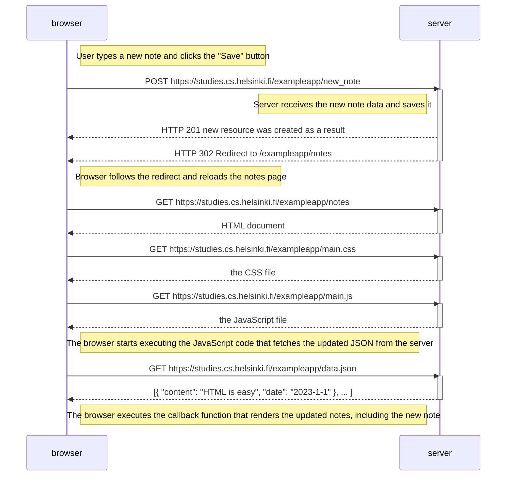

# New Note Diagram

The following diagram shows the flow of creating a new note:

1. First, the user enters text and clicks the save button, triggering a POST 
request to /new_note.
2. The server processes the new note and responds with a redirect.
3. Due to the redirect, the browser reloads the notes page, requiring:
   - A request for the HTML document
   - A request for the CSS file
   - A request for the JavaScript file
   - A request for the updated notes data (JSON)

Finally, the browser renders all notes including the new one.

