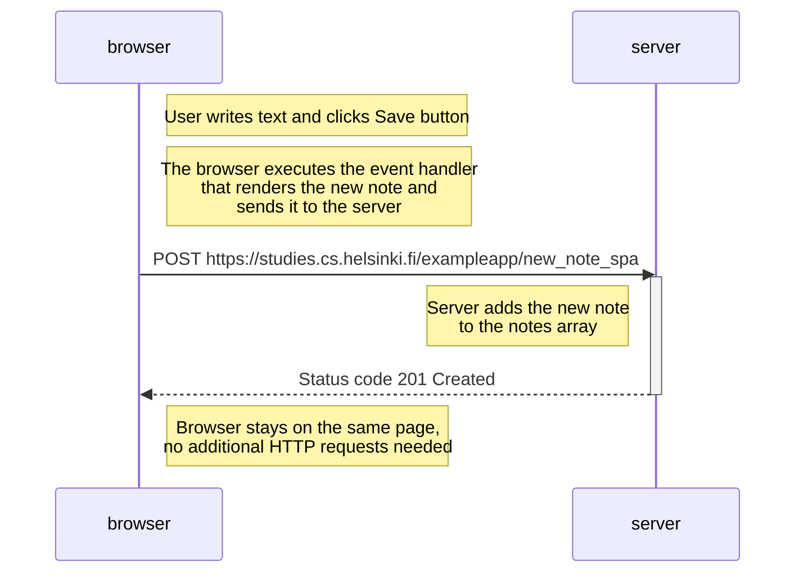

# New Note Single Page App Diagram

The following diagram shows the flow of creating a new note in the SPA version of the notes.

This sequence diagram shows the flow
when a user creates a new note in the SPA version,
which is notably different from the traditional wepage version,
since it doesn't reload the page.

