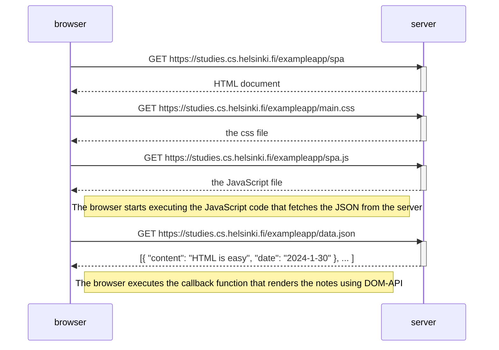

# Single Page App Diagram

This sequence diagram shows what happens when a user first visits the SPA
version of the notes app.

The main differences from the traditional webpage version are:
- The page requests a different JavaScript file (spa.js instead of main.js)
- This JavaScript code is set up to handle the SPA functionality
- The page rendering is handled by the JavaScript code using the DOM-API
- There's no form submission that causes a page reload

